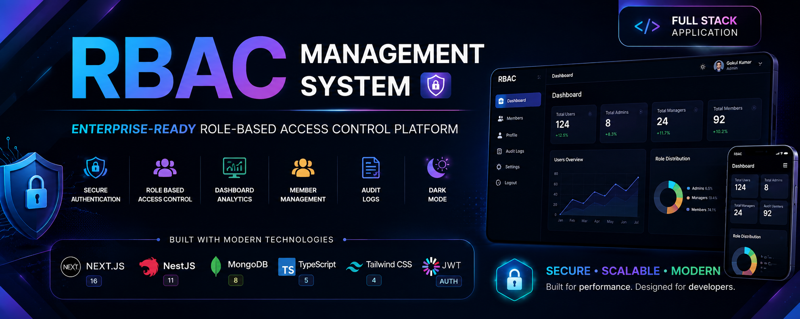

<p align="center">
  
</p>

<div align="center">

# 🚀 Enterprise RBAC Management System

### Secure • Scalable • Enterprise-Ready Role-Based Access Control Web Application

⭐ Built with **Next.js + NestJS + MongoDB**

🔐 Secure JWT Authentication  
🎭 Role-Based Authorization (RBAC)  
🚀 Production-Ready Architecture

---

<p>
A modern Full Stack Role-Based Access Control (RBAC) application built using
<strong>Next.js</strong>, <strong>NestJS</strong>, <strong>MongoDB</strong>,
<strong>TypeScript</strong>, and <strong>JWT Authentication</strong>.
</p>

<p>
Designed as a professional Full Stack Developer Interview Assignment demonstrating modern authentication, authorization, secure REST APIs, scalable backend architecture, responsive frontend development, and enterprise software engineering practices.
</p>

---


</div>

---

## 📑 Table of Contents

1. [Demo Preview](#-demo-preview)
2. [Project Overview](#-project-overview)
3. [Project Objectives](#-project-objectives)
4. [Key Features](#-key-features)
5. [Assignment Completion Checklist](#-assignment-completion-checklist)
6. [System Architecture](#️-system-architecture)
7. [Technology Stack](#️-technology-stack)
8. [Why This Tech Stack](#-why-this-tech-stack)
9. [Project Structure](#-project-structure)
10. [Getting Started](#-getting-started)
11. [Environment Setup](#️-environment-setup)
12. [Running the Application](#️-running-the-application)
13. [API Documentation](#-api-documentation)
14. [REST API Endpoints](#-rest-api-endpoints)
15. [Database Collections](#️-database-collections)
16. [Database Schema](#️-database-schema)
17. [Authentication Flow](#-authentication-flow)
18. [Security Implementation](#️-security-implementation)
19. [Testing the APIs](#-testing-the-apis)
20. [Application Screenshots](#-application-screenshots)
21. [Future Enhancements](#-future-enhancements)
22. [Best Practices Followed](#-best-practices-followed)
23. [Assignment Deliverables](#-assignment-deliverables)
24. [Project Metrics](#-project-metrics)
25. [Learning Outcomes](#-learning-outcomes)
26. [Contributing](#-contributing)
27. [License](#-license)
28. [Support](#-support)
29. [Author](#-author)

---

# 🎥 Demo Preview

## Application Flow

```text
User Registration
        │
        ▼
Secure Login
        │
        ▼
JWT Authentication
        │
        ▼
Role-Based Dashboard
        │
        ▼
Member Management
        │
        ▼
Profile Management
        │
        ▼
Logout
```

> 📸 Screenshots and live demo will be added after deployment.

---

# 📖 Project Overview

The **Enterprise RBAC Management System** is a modern Full Stack web application that demonstrates secure authentication, authorization, role-based access control, dashboard analytics, and member management.

The project was developed following enterprise software architecture principles using **Next.js**, **NestJS**, and **MongoDB** while implementing secure authentication through **JWT Access Tokens** and **Refresh Tokens**.

This project demonstrates production-level coding practices including:

- Secure Authentication
- Role-Based Authorization
- RESTful API Design
- Modular Backend Architecture
- Responsive Frontend Development
- Clean Folder Structure
- Type Safety with TypeScript
- API Documentation using Swagger

The objective is to showcase how enterprise applications manage users, permissions, authentication, and protected resources using scalable backend architecture.

---

# 🎯 Project Objectives

The project focuses on implementing real-world enterprise authentication and authorization workflows.

## Primary Goals

- Build a secure authentication system
- Implement Role-Based Access Control (RBAC)
- Protect REST APIs using JWT
- Develop reusable backend architecture
- Demonstrate scalable NestJS modules
- Build responsive Next.js UI
- Implement secure CRUD operations
- Follow enterprise coding standards
- Demonstrate clean software architecture
- Create production-ready documentation

---

# ✨ Key Features

## 🔐 Authentication

The application provides a secure authentication system following modern industry standards.

- ✅ User Registration
- ✅ Secure Login
- ✅ JWT Access Token Authentication
- ✅ Refresh Token Authentication
- ✅ Password Hashing using bcrypt
- ✅ Protected Routes
- ✅ Route Guards
- ✅ Logout Support
- ✅ Request Validation
- ✅ Secure API Authorization

---

## 👥 Role-Based Access Control

The application follows a Role-Based Access Control (RBAC) model where permissions are granted according to user roles.

### Available Roles

| Role | Description |
|------|-------------|
| 👑 Admin | Complete access to the system |
| 🛡️ Manager | Can manage members except deletion |
| 👤 Member | Read-only access |

### 🔑 Permission Matrix

| Feature | 👑 Admin | 🛡️ Manager | 👤 Member |
|---------|:--------:|:----------:|:---------:|
| Dashboard | ✅ | ✅ | ✅ |
| View Members | ✅ | ✅ | ✅ |
| View Member Details | ✅ | ✅ | ✅ |
| Create Member | ✅ | ✅ | ❌ |
| Edit Member | ✅ | ✅ | ❌ |
| Delete Member | ✅ | ❌ | ❌ |
| View Profile | ✅ | ✅ | ✅ |
| Logout | ✅ | ✅ | ✅ |

---

## 📊 Dashboard

The dashboard provides administrators and authorized users with a quick overview of the application's current state, using a modern responsive card-based layout that works across desktop, tablet, and mobile devices.

### Dashboard Widgets

- 👥 Total Users
- 👑 Total Admins
- 🛡️ Total Managers
- 👤 Total Members

### Dashboard Highlights

- ✅ Responsive Card Layout
- ✅ Clean Modern UI
- ✅ Role-Based Visibility
- ✅ Secure API Integration
- ✅ Mobile Friendly
- ✅ Fast Page Rendering

---

## 👨‍💼 Member Management

The Member Management module enables authorized users to perform CRUD operations while respecting Role-Based Access Control permissions.

### Available Operations

| Operation | Admin | Manager | Member |
|-----------|:-----:|:-------:|:------:|
| View Members | ✅ | ✅ | ✅ |
| View Member Details | ✅ | ✅ | ✅ |
| Create Member | ✅ | ✅ | ❌ |
| Update Member | ✅ | ✅ | ❌ |
| Delete Member | ✅ | ❌ | ❌ |

### Module Highlights

- ➕ Create Members
- 👀 View Member Details
- ✏️ Update Member Information
- ❌ Delete Members (Admin Only)
- 📱 Responsive Table Design
- 🔐 RBAC Protected Operations

> Search and pagination enhancements can be integrated depending on project requirements.

---

## 👤 Profile Management

Each authenticated user has access to their own profile.

- View Profile Information
- Display User Role
- Secure Authentication
- JWT Protected Endpoint
- Responsive User Interface

---

## 🛡️ Security Features

Security has been implemented following modern backend development best practices.

### Authentication Security

- ✅ JWT Access Token
- ✅ JWT Refresh Token
- ✅ Password Hashing using bcrypt
- ✅ Protected API Routes
- ✅ Authentication Guards

### Authorization Security

- ✅ Role-Based Access Control
- ✅ Role Guards
- ✅ Protected Resources
- ✅ Permission-Based Access

### Backend Security

- ✅ DTO Validation
- ✅ ValidationPipe
- ✅ Input Validation
- ✅ Exception Handling
- ✅ Secure Environment Variables
- ✅ CORS Configuration

---

## 🎁 Additional Features

| Feature | Status |
|---------|:------:|
| 🌙 Dark Mode | ✅ |
| 📘 Swagger API Documentation | ✅ |
| 🔐 JWT Refresh Token | ✅ |
| 📄 Protected APIs | ✅ |
| 📱 Responsive Design | ✅ |
| 🎭 Role-Based Authorization | ✅ |

> Audit logging, advanced search, and pagination can be added or expanded based on future project requirements.

---

# ✅ Assignment Completion Checklist

| Requirement | Status |
|-------------|:------:|
| User Registration | ✅ |
| User Login | ✅ |
| JWT Authentication | ✅ |
| Refresh Token | ✅ |
| Password Hashing | ✅ |
| Role-Based Access Control | ✅ |
| Dashboard | ✅ |
| CRUD Operations | ✅ |
| Protected APIs | ✅ |
| Request Validation | ✅ |
| DTO Validation | ✅ |
| CORS Configuration | ✅ |
| Swagger Documentation | ✅ |
| Responsive UI | ✅ |

---

# 🏗️ System Architecture

```text
                         ┌──────────────────────┐
                         │      Web Browser     │
                         └──────────┬───────────┘
                                    │
                                    ▼
                    ┌────────────────────────────────┐
                    │      Next.js Frontend          │
                    │────────────────────────────────│
                    │ • Login                        │
                    │ • Register                     │
                    │ • Dashboard                    │
                    │ • Members                      │
                    │ • Profile                      │
                    │ • Protected Routes             │
                    └──────────┬─────────────────────┘
                               │
                        Axios REST API
                               │
                               ▼
                 ┌──────────────────────────────────┐
                 │        NestJS Backend            │
                 │──────────────────────────────────│
                 │ • Authentication                 │
                 │ • Authorization (RBAC)           │
                 │ • JWT Access Token               │
                 │ • Refresh Token                  │
                 │ • Member CRUD                    │
                 │ • Swagger API                    │
                 │ • Validation                     │
                 └──────────┬───────────────────────┘
                            │
                     Mongoose ODM
                            │
                            ▼
                 ┌──────────────────────────────┐
                 │          MongoDB             │
                 │──────────────────────────────│
                 │ • Users                      │
                 │ • Members                    │
                 │ • Refresh Tokens             │
                 └──────────────────────────────┘
```

---

# 🛠️ Technology Stack

## 🎨 Frontend

| Technology | Purpose |
|------------|---------|
| Next.js 16 | React Framework |
| TypeScript | Type Safety |
| Tailwind CSS | UI Development |
| Axios | API Communication |
| Lucide React | Icons |

## ⚙️ Backend

| Technology | Purpose |
|------------|---------|
| NestJS | REST API Development |
| MongoDB | NoSQL Database |
| Mongoose | ODM |
| JWT | Authentication |
| Passport JWT | Route Protection |
| bcrypt | Password Hashing |
| Swagger | API Documentation |

## 🧰 Development Tools

| Tool | Purpose |
|------|---------|
| Git | Version Control |
| GitHub | Source Code Hosting |
| VS Code | Development Environment |
| Postman | API Testing |

---

# 🎯 Why This Tech Stack?

This project adopts technologies commonly used in enterprise software development.

### Next.js

- App Router
- Server Components
- Fast Rendering
- Modern React Features

### NestJS

- Modular Architecture
- Dependency Injection
- Scalable Backend
- Built-in Validation
- Swagger Integration

### MongoDB

- Flexible Document Database
- Fast Development
- Mongoose ODM
- Scalable Collections

### TypeScript

- Strong Typing
- Better Maintainability
- Improved Developer Experience
- Reduced Runtime Errors

---

# 📂 Project Structure

The project follows a clean and modular Full Stack architecture by separating the frontend and backend into independent applications.

```text
enterprise-rbac-management-system
│
├── frontend
│   ├── app
│   │   ├── dashboard
│   │   ├── login
│   │   ├── members
│   │   ├── profile
│   │   ├── register
│   │   └── layout.tsx
│   │
│   ├── components
│   ├── hooks
│   ├── services
│   ├── lib
│   ├── middleware
│   ├── types
│   ├── utils
│   ├── public
│   └── package.json
│
├── backend
│   ├── src
│   │   ├── auth
│   │   ├── users
│   │   ├── members
│   │   ├── dashboard
│   │   ├── common
│   │   ├── config
│   │   ├── guards
│   │   ├── decorators
│   │   ├── strategies
│   │   ├── schemas
│   │   └── main.ts
│   │
│   ├── package.json
│   └── tsconfig.json
│
├── README.md
├── LICENSE
├── .env.example
└── .gitignore
```

---

# 🚀 Getting Started

Follow the steps below to set up the project locally.

## 📥 Clone Repository

```bash
git clone https://github.com/Gokul768/rbac-management-system.git
```

Move into the project folder.

```bash
cd rbac-management-system
```

## 📦 Backend Installation

Navigate to the backend directory.

```bash
cd backend
```

Install dependencies.

```bash
npm install
```

Run the development server.

```bash
npm run start:dev
```

Backend runs on:

```text
http://localhost:5000
```

## 💻 Frontend Installation

Navigate to the frontend directory.

```bash
cd frontend
```

Install dependencies.

```bash
npm install
```

Start the frontend.

```bash
npm run dev
```

Frontend runs on:

```text
http://localhost:3000
```

---

# ⚙️ Environment Setup

Create the environment files before running the project.

## Backend

Create `backend/.env`

```env
PORT=5000

MONGODB_URI=your_mongodb_connection_string

JWT_SECRET=your_jwt_secret

JWT_REFRESH_SECRET=your_refresh_secret

JWT_EXPIRES_IN=15m

JWT_REFRESH_EXPIRES_IN=7d
```

## Frontend

Create `frontend/.env.local`

```env
NEXT_PUBLIC_API_URL=http://localhost:5000
```

## 📄 .env.example

For open-source contributors, an example environment file is included.

```bash
cp .env.example .env
```

Update the values with your own credentials.

```env
PORT=

MONGODB_URI=

JWT_SECRET=

JWT_REFRESH_SECRET=

JWT_EXPIRES_IN=

JWT_REFRESH_EXPIRES_IN=
```

---

# ▶️ Running the Application

## Backend

```bash
npm run start:dev
```

## Frontend

```bash
npm run dev
```

---

# 📚 API Documentation

Swagger is enabled for easy API testing and documentation.

After starting the backend, visit

```text
http://localhost:5000/api
```

Swagger provides:

- Authentication APIs
- Member APIs
- Request Models
- Response Schemas
- JWT Authorization
- Interactive API Testing

---

# 📡 REST API Endpoints

## Authentication

| Method | Endpoint | Description |
|--------|----------|-------------|
| POST | /auth/register | Register User |
| POST | /auth/login | Login |
| POST | /auth/refresh | Refresh Token |
| POST | /auth/logout | Logout |
| GET | /auth/profile | User Profile |

## Members

| Method | Endpoint | Description |
|--------|----------|-------------|
| GET | /members | Get Members |
| GET | /members/:id | Get Member |
| POST | /members | Create Member |
| PUT | /members/:id | Update Member |
| DELETE | /members/:id | Delete Member |

---

# 🗄️ Database Collections

The application uses MongoDB with separate collections.

| Collection | Purpose |
|------------|---------|
| Users | Stores registered users |
| Members | Stores member information |
| Refresh Tokens | Stores active refresh tokens |
| Audit Logs | Stores system activity records |

---

# 🗄️ Database Schema

The application uses MongoDB collections with proper data modeling and relationships.

The database schema includes:

- Users Collection
- Members Collection
- Refresh Tokens Collection
- Audit Logs Collection

<p align="center">
  
</p>

---

# 🔐 Authentication Flow

```text
             Register
                 │
                 ▼
          User Created
                 │
                 ▼
              Login
                 │
        ┌────────┴────────┐
        ▼                 ▼
 Access Token       Refresh Token
   (15 Minutes)       (7 Days)
        │
        ▼
 Protected APIs
        │
        ▼
 Authorized Request
```

---

# 🛡️ Security Implementation

Security follows enterprise best practices.

| Security Feature | Status |
|-------------------|:------:|
| Password Hashing | ✅ |
| JWT Authentication | ✅ |
| Refresh Tokens | ✅ |
| Role Guards | ✅ |
| Protected Routes | ✅ |
| DTO Validation | ✅ |
| ValidationPipe | ✅ |
| Environment Variables | ✅ |
| CORS Configuration | ✅ |
| Exception Filters | ✅ |

---

# 🧪 Testing the APIs

You can test APIs using:

- Swagger UI
- Postman
- Thunder Client
- Insomnia

Recommended flow:

1. Register User
2. Login
3. Copy JWT Token
4. Authorize in Swagger
5. Test Protected APIs

---

# 📸 Application Screenshots

> Screenshots will be added after deployment.

## 🔐 Login Page

Displays secure authentication with JWT.

```text
/screenshots/login.png
```

## 📝 Registration Page

New users can create an account.

```text
/screenshots/register.png
```

## 📊 Dashboard

Displays application statistics.

```text
/screenshots/dashboard.png
```

## 👥 Members

Manage members according to user role.

```text
/screenshots/members.png
```

## 👤 Profile

Displays authenticated user's information.

```text
/screenshots/profile.png
```

## 🌙 Dark Mode

Responsive dark theme.

```text
/screenshots/dark-mode.png
```

---

# ☁️ Database Deployment

## MongoDB Atlas

- Create Cluster
- Create Database User
- Whitelist IP
- Copy Connection String

---

# 📈 Future Enhancements

The project is designed with scalability in mind. Planned improvements include:

- Email Verification
- Forgot Password
- Password Reset
- User Avatar Upload
- Dashboard Charts
- Advanced Analytics
- Export Members to Excel
- Export Members to PDF
- Email Notifications
- Docker Support
- CI/CD Pipeline
- Unit Testing
- Integration Testing
- Audit Dashboard
- Activity Timeline
- Advanced Search
- Pagination Improvements
- Multi-language Support

---

# 💡 Best Practices Followed

This project follows modern Full Stack engineering practices.

## Backend

- Modular Architecture
- Feature Modules
- Dependency Injection
- DTO Validation
- ValidationPipe
- Exception Filters
- Route Guards
- JWT Strategy
- Refresh Tokens
- Clean Code
- Reusable Services

## Frontend

- App Router
- Reusable Components
- Custom Hooks
- Responsive Design
- API Service Layer
- Type Safety
- Loading States
- Error Handling

## Security

- Password Hashing
- JWT Authentication
- Protected APIs
- Role Guards
- Environment Variables
- Input Validation
- Secure REST APIs

---

# 📋 Assignment Deliverables

| Deliverable | Status |
|-------------|:------:|
| GitHub Repository | ✅ |
| README Documentation | ✅ |
| Swagger Documentation | ✅ |
| Backend APIs | ✅ |
| Frontend UI | ✅ |
| Authentication | ✅ |
| RBAC | ✅ |
| CRUD Operations | ✅ |
| Environment Setup Guide | ✅ |
| .env.example | ✅ |

---

# 📊 Project Metrics

| Metric | Value |
|--------|------:|
| Frontend | Next.js 15/16 |
| Backend | NestJS |
| Database | MongoDB |
| Authentication | JWT |
| User Roles | 3 |
| CRUD Modules | 1 |
| Dashboard Cards | 4 |
| Protected APIs | 10+ |
| Swagger APIs | Yes |
| Responsive UI | Yes |
| TypeScript | Yes |

---

# 🎯 Learning Outcomes

During this project I gained hands-on experience with:

- Enterprise Authentication
- JWT Access & Refresh Tokens
- Role-Based Access Control
- NestJS Framework
- Next.js App Router
- MongoDB & Mongoose
- REST API Development
- Swagger Documentation
- DTO Validation
- Route Guards
- TypeScript
- Responsive UI Development
- Git & GitHub Workflow

---

# 🤝 Contributing

Contributions are welcome. If you'd like to improve this project:

1. Fork the repository
2. Create a new branch

```bash
git checkout -b feature-name
```

3. Commit your changes

```bash
git commit -m "Add new feature"
```

4. Push

```bash
git push origin feature-name
```

5. Open a Pull Request

---

# 📜 License

This project is licensed under the MIT License.

Feel free to use this repository for learning and educational purposes.

---

# ⭐ Support

If you found this repository useful:

- ⭐ Star this repository
- 🍴 Fork this repository
- 💬 Share your feedback
- 🐛 Report issues

---

# 🙋 Author

## Gokul Kumar M

Full Stack Developer

**GitHub:** https://github.com/Gokul768

**LinkedIn:** https://www.linkedin.com/in/gokulkumar-m-8aa977355

---

<div align="center">

# 🚀 Thank You

Thank you for taking the time to review this project.

This project demonstrates modern Full Stack Development practices using Next.js, NestJS, MongoDB, JWT Authentication, and Role-Based Access Control.

If you found this project helpful, consider giving it a ⭐ on GitHub.

Made with ❤️ by **Gokul Kumar M**

</div>